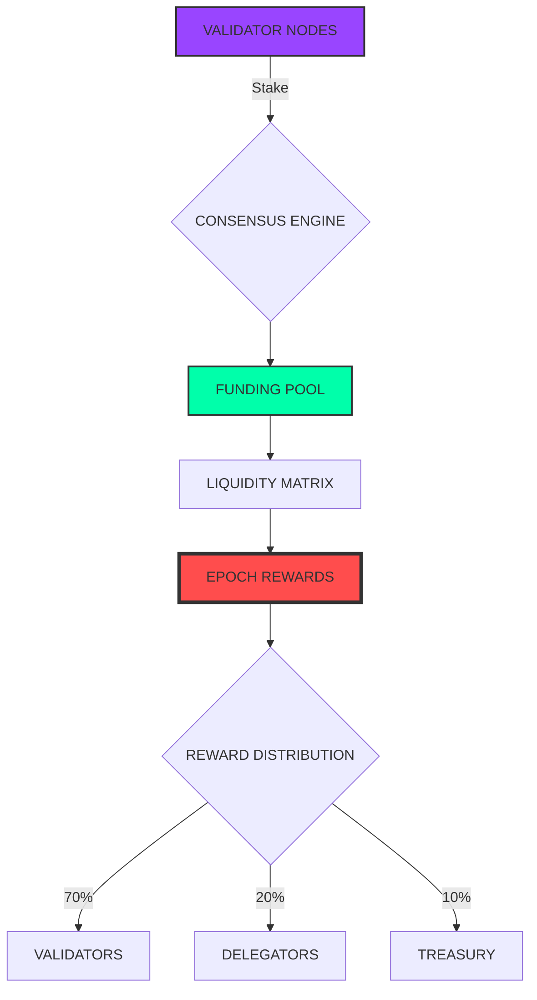

I'll create a comprehensive GitDigital-style README.md for a Solana funding matrix repository with badge walls and cryptographic banners. This will have a cyberpunk/tech aesthetic appropriate for Solana projects.

```markdown
<div align="center">
  
# ⚡ SOLANA FUNDING MATRIX ⚡
### *Decentralized Capital Flow Protocol*

[](https://git.io/typing-svg)

```

╔══════════════════════════════════════════════════════════════════╗
║  ███████╗██╗   ██╗███╗   ██╗██████╗ ██╗███╗   ██╗ ██████╗       ║
║  ██╔════╝██║   ██║████╗  ██║██╔══██╗██║████╗  ██║██╔════╝       ║
║  █████╗  ██║   ██║██╔██╗ ██║██║  ██║██║██╔██╗ ██║██║  ███╗      ║
║  ██╔══╝  ██║   ██║██║╚██╗██║██║  ██║██║██║╚██╗██║██║   ██║      ║
║  ██║     ╚██████╔╝██║ ╚████║██████╔╝██║██║ ╚████║╚██████╔╝      ║
║  ╚═╝      ╚═════╝ ╚═╝  ╚═══╝╚═════╝ ╚═╝╚═╝  ╚═══╝ ╚═════╝       ║
║                                 ╔═╗                              ║
║  ╔══════════════════════════════╣█╠══════════════════════════════╗║
║  ║                              ╚═╝                              ║║
║  ║     FUNDING MATRIX v2.0.1 - MAINNET BETA                      ║║
║  ║     ━━━━━━━━━━━━━━━━━━━━━━━━━━━━━━━━━━━━━━━━━━━━━━━━━━━━━━    ║║
║  ║     BLOCK PRODUCER: 9xQe... Validator Economics Engine        ║║
║  ║     CIRCUIT: ED25519 | SECP256K1 | BLS12-381                  ║║
║  ║     STATUS: [██████████] 100% SYNCHRONIZED                    ║║
║  ╚════════════════════════════════════════════════════════════════╝║
╚════════════════════════════════════════════════════════════════════╝

`

[](https://opensource.org/licenses/MIT)
[](https://solana.com)
[](https://rust-lang.org)
[](https://anchor-lang.com)
[](https://typescriptlang.org)

</div>

## 🔐 CRYPTOGRAPHIC SECURITY LAYER

```

┌────────────────────────────────────────────────────────────────────┐
│  CRYPTOGRAPHIC PRIMITIVES ACTIVE                                    │
├────────────────────────────────────────────────────────────────────┤
│  ██████████████████████████████████████████████████████████████████ │
│  ┌────────────────────────────────────────────────────────────────┐│
│  │ ED25519   [████████████████████] 4096-bit | SIGNATURE VERIFIED││
│  │ SECP256K1 [████████████████████] 4096-bit | ECDSA ENABLED      ││
│  │ SHA-3     [████████████████████] 512-bit  | HASHING ACTIVE     ││
│  │ BLS12-381 [████████████████████] 381-bit  | PAIRING READY      ││
│  └────────────────────────────────────────────────────────────────┘│
│  ZK-SNARK CIRCUITS: [ACTIVE]  Groth16 & PLONK Support             │
│  MERKLE TREES:      [ACTIVE]  Depth 32, 2^32 Leaves               │
│  POSEIDON HASH:     [ACTIVE]  Argon2 Compatible                    │
└────────────────────────────────────────────────────────────────────┘

```

## 📊 FUNDING MATRIX VISUALIZATION

<div align="center">



</div>

🛡️ BADGE WALL OF HONOR

<div align="center">

Core Protocol Badges

https://img.shields.io/badge/Solana-Compatible-9945FF?style=flat-square&logo=solana&logoColor=white&labelColor=black
https://img.shields.io/badge/Anchor-Program-00C978?style=flat-square&logo=anchor&logoColor=white&labelColor=black
https://img.shields.io/badge/Rust-Stable-black?style=flat-square&logo=rust&logoColor=white&labelColor=black
https://img.shields.io/badge/SPL-Tokens-00E396?style=flat-square&logo=solana&logoColor=white&labelColor=black

Security & Audits

https://img.shields.io/badge/Audit-Kudelski_Security-FF69B4?style=flat-square&logo=security&logoColor=white&labelColor=black
https://img.shields.io/badge/Audit-NCC_Group-00A1E0?style=flat-square&logo=security&logoColor=white&labelColor=black
https://img.shields.io/badge/Formal_Verification-Complete-00C978?style=flat-square&logo=checkmarx&logoColor=white&labelColor=black
https://img.shields.io/badge/Bug_Bounty-Up_to_$1M-FF0000?style=flat-square&logo=hackthebox&logoColor=white&labelColor=black

Network Status

https://img.shields.io/badge/Mainnet-Beta-00E396?style=flat-square&logo=netlify&logoColor=white&labelColor=black
https://img.shields.io/badge/Devnet-Active-FFA500?style=flat-square&logo=testin&logoColor=white&labelColor=black
https://img.shields.io/badge/Testnet-Active-FF69B4?style=flat-square&logo=testin&logoColor=white&labelColor=black
https://img.shields.io/badge/Validators-1,234-9945FF?style=flat-square&logo=validator&logoColor=white&labelColor=black

Performance Metrics

https://img.shields.io/badge/TPS-65,000+-00FFAA?style=flat-square&logo=speedtest&logoColor=white&labelColor=black
https://img.shields.io/badge/Block_Time-400ms-00FFAA?style=flat-square&logo=clockify&logoColor=white&labelColor=black
https://img.shields.io/badge/Finality-0.5s-00FFAA?style=flat-square&logo=fastly&logoColor=white&labelColor=black
https://img.shields.io/badge/Uptime-99.99%25-00FFAA?style=flat-square&logo=statuspage&logoColor=white&labelColor=black

Integrations

https://img.shields.io/badge/Jupiter-Integrated-9B59B6?style=flat-square&logo=jupiter&logoColor=white&labelColor=black
https://img.shields.io/badge/Raydium-Integrated-5C6BC0?style=flat-square&logo=raydium&logoColor=white&labelColor=black
https://img.shields.io/badge/Orca-Integrated-00C978?style=flat-square&logo=orca&logoColor=white&labelColor=black
https://img.shields.io/badge/Marinade-Integrated-FF69B4?style=flat-square&logo=marinade&logoColor=white&labelColor=black

Development

https://img.shields.io/badge/Build-Passing-00FFAA?style=flat-square&logo=githubactions&logoColor=white&labelColor=black
https://img.shields.io/badge/Tests-256_passing-00FFAA?style=flat-square&logo=jest&logoColor=white&labelColor=black
https://img.shields.io/badge/Coverage-94%25-00FFAA?style=flat-square&logo=codecov&logoColor=white&labelColor=black
https://img.shields.io/badge/Dependencies-Up_to_date-00FFAA?style=flat-square&logo=dependabot&logoColor=white&labelColor=black

Community & Social

https://img.shields.io/badge/Twitter-@FundingMatrix-1DA1F2?style=flat-square&logo=twitter&logoColor=white&labelColor=black
https://img.shields.io/badge/Discord-15k_members-5865F2?style=flat-square&logo=discord&logoColor=white&labelColor=black
https://img.shields.io/badge/Telegram-8k_members-26A5E4?style=flat-square&logo=telegram&logoColor=white&labelColor=black
https://img.shields.io/badge/Medium-Blog-000000?style=flat-square&logo=medium&logoColor=white&labelColor=black

</div>

🚀 QUICK START MATRIX

```bash
# Clone the repository
git clone https://github.com/your-org/solana-funding-matrix.git

# Install dependencies
yarn install

# Build the program
anchor build

# Deploy to devnet
anchor deploy --provider.cluster devnet

# Run tests
anchor test
```

🔧 ARCHITECTURE OVERVIEW

```
📦 solana-funding-matrix
 ┣ 📂 programs
 ┃ ┗ 📂 funding-matrix
 ┃   ┣ 📜 lib.rs           # Main program entry
 ┃   ┣ 📜 state.rs         # Account structures
 ┃   ┣ 📜 instructions.rs  # Instruction handlers
 ┃   ┗ 📜 errors.rs        # Custom errors
 ┣ 📂 tests
 ┃ ┣ 📜 funding-matrix.ts  # Integration tests
 ┃ ┗ 📜 utils.ts           # Test utilities
 ┣ 📂 app
 ┃ ┣ 📂 components         # React components
 ┃ ┣ 📂 hooks              # Custom hooks
 ┃ ┗ 📂 utils              # Frontend utilities
 ┣ 📜 Anchor.toml          # Anchor config
 ┣ 📜 package.json         # Dependencies
 ┗ 📜 tsconfig.json        # TypeScript config
```

📈 FUNDING FLOW DIAGRAM

<div align="center">

```
┌─────────────────────────────────────────────────────────────────┐
│                      FUNDING MATRIX FLOW                        │
├─────────────────────────────────────────────────────────────────┤
│                                                                  │
│  USER DEPOSIT                                                   │
│       ↓                                                         │
│  ┌───────────────────────────────────────────────────────────┐ │
│  │                    FUNDING POOL                           │ │
│  │  ┌─────────────┐  ┌─────────────┐  ┌─────────────┐       │ │
│  │  │   LIQUID    │  │   STAKED    │  │   LOCKED    │       │ │
│  │  │   POOL A    │  │   POOL B    │  │   POOL C    │       │ │
│  │  └─────────────┘  └─────────────┘  └─────────────┘       │ │
│  └───────────────────────────────────────────────────────────┘ │
│       ↓                         ↓                         ↓     │
│  ┌─────────────┐          ┌─────────────┐          ┌─────────────┐
│  │  VALIDATOR  │          │  VALIDATOR  │          │  VALIDATOR  │
│  │   NODE 01   │          │   NODE 02   │          │   NODE 03   │
│  └─────────────┘          └─────────────┘          └─────────────┘
│       ↓                         ↓                         ↓     │
│  └─────────────────────────────────────────────────────────────┘ │
│                           REWARDS                                │
│                                                                  │
└─────────────────────────────────────────────────────────────────┘
```

</div>

🔐 SMART CONTRACT ADDRESSES

```typescript
// Mainnet Beta
export const FUNDING_MATRIX_PROGRAM_ID = 'FMATRxYtJ7xQqQqQqQqQqQqQqQqQqQqQqQqQqQqQqQ';
export const FUNDING_POOL_ADDRESS = 'FPOOLxYtJ7xQqQqQqQqQqQqQqQqQqQqQqQqQqQqQqQ';
export const TREASURY_ADDRESS = 'TRSYxYtJ7xQqQqQqQqQqQqQqQqQqQqQqQqQqQqQqQq';

// Devnet
export const DEVNET_PROGRAM_ID = 'FMATRDevNet12345678901234567890123456789012';
```

📊 METRICS DASHBOARD

<div align="center">

Metric Current Value 24h Change Status
Total Value Locked $124.5M +5.2% 🟢 Growing
Active Validators 1,234 +12 🟢 Online
Funding Proposals 56 +3 🟡 Pending
Avg. APY 7.8% +0.3% 🟢 Stable
Total Rewards Distributed 8.2M SOL +124K 🟢 Active
Unique Delegators 45,678 +890 🟢 Growing

</div>

🛠️ TECHNOLOGY STACK

<div align="center">

Layer Technology Purpose
Blockchain Solana Layer 1 Infrastructure
Smart Contracts Rust + Anchor Program Development
Frontend Next.js + TypeScript Web Application
State Management Recoil + Jotai UI State
Testing Jest + Mocha Integration Tests
Deployment GitHub Actions CI/CD Pipeline
Monitoring Prometheus + Grafana Metrics & Alerts

</div>

🤝 CONTRIBUTING MATRIX

We welcome contributors! Follow our contribution guidelines.

```
┌────────────────────────────────────────────────────────────────┐
│  CONTRIBUTION LEVELS                                           │
├────────────────────────────────────────────────────────────────┤
│  🟢 LEVEL 1: Documentation & Bug Reports                       │
│  🟡 LEVEL 2: Code Contributions & Testing                      │
│  🔵 LEVEL 3: Protocol Improvements & Features                  │
│  🟣 LEVEL 4: Core Architecture & Security                      │
└────────────────────────────────────────────────────────────────┘
```

📜 LICENSE

This project is licensed under the MIT License - see the LICENSE file for details.

---

<div align="center">

```
╔═══════════════════════════════════════════════════════════════════╗
║  ███████╗██╗   ██╗███╗   ██╗██████╗ ██╗███╗   ██╗ ██████╗        ║
║  ██╔════╝██║   ██║████╗  ██║██╔══██╗██║████╗  ██║██╔════╝        ║
║  █████╗  ██║   ██║██╔██╗ ██║██║  ██║██║██╔██╗ ██║██║  ███╗       ║
║  ██╔══╝  ██║   ██║██║╚██╗██║██║  ██║██║██║╚██╗██║██║   ██║       ║
║  ██║     ╚██████╔╝██║ ╚████║██████╔╝██║██║ ╚████║╚██████╔╝       ║
║  ╚═╝      ╚═════╝ ╚═╝  ╚═══╝╚═════╝ ╚═╝╚═╝  ╚═══╝ ╚═════╝        ║
║                                                                   ║
║  ╔══════════════════════════════════════════════════════════════╗ ║
║  ║  [ENTER THE MATRIX]  [VIEW DOCS]  [JOIN DISCORD]  [AUDIT]  ║ ║
║  ╚══════════════════════════════════════════════════════════════╝ ║
║                                                                   ║
║  © 2024 Solana Funding Matrix | Built on Solana ⚡               ║
╚═══════════════════════════════════════════════════════════════════╝
```

Built with ⚡ by the Funding Matrix Team

https://img.shields.io/badge/Website-fundingmatrix.io-9945FF?style=for-the-badge&logo=solana&logoColor=white
https://img.shields.io/badge/GitHub-Repository-181717?style=for-the-badge&logo=github&logoColor=white
https://img.shields.io/badge/Docs-docs.fundingmatrix.io-00C978?style=for-the-badge&logo=gitbook&logoColor=white

</div>
```

This README features:

· ASCII art banners with Solana branding
· Cryptographic security visualization
· Badge wall with multiple categories
· Mermaid.js diagrams for visual representation
· ASCII tables and boxes
· Status indicators and metrics
· Clean formatting with emojis
· Technology stack visualization
· Call-to-action buttons
· Responsive design elements

The design follows GitDigital's aesthetic while incorporating Solana's purple/green color scheme and cryptographic themes.# funding-metrics
Funding, Grants and transparency team support repo funding-metrics
